  

  

Building scalable, modern and production-ready web applications with clean code and efficient backend architecture.

  

  

  

---

## 🚀 About Me

- 💻 Full Stack Web Developer specializing in Laravel & React.
- 🌱 Currently exploring System Design, Docker, and AWS.
- 🐛 Passionate about debugging and solving real-world problems.
- ⚡ Writing clean, scalable, and maintainable code.
- 🎯 Building software that delivers real business value.
---

# 💻 Tech Stack

### Frontend

  

### Backend

  

### Database

  

### Tools & Technologies

  

---

<h2 align="left">📊 GitHub Metrics</h2>

  

---
## 🚧 What I'm Building

Currently working on private repositories focused on:

- 🛒 Full Stack E-Commerce Platform
- 📚 Learning Management System
- 💬 Real-time Chat Application

> 🚀 These projects will be open-sourced after production release.

---

   <strong>"Great software starts with a solid understanding of the problem"</strong>

